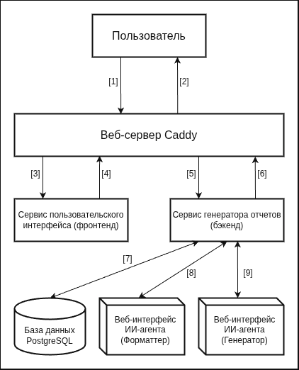

# SUAI lab
Платформа для генерации отчетов для лабораторных работ по ГОСТ
 
 

## Общая архитектура

 

## Фронтенд

### Страницы
| Название | Описание | Файл | Авторизация |
|----------|----------|----------|----------|
| Главная | Лэндинг | index.html | Нет |
| Авторизация | Регистрация и вход | auth.html | Нет |
| Список | Список генераций пользователя | list.html | Есть |
| Генерация | Страница генерации отчета | generate.html | Есть |
 

## Бэкенд
### Сервисы
| Название | Описание | Файл |
|----------|----------|----------|
| user | Работа с пользователями, авторизация, регистрация | index.html |
| lab | Генерация и получение лабораторных работ | auth.html |

### Структура сервиса

| Название пакета | Описание |
|----------|----------|
| application | Бизнес-логика (например проверка пароля пользователя при логине) |
| domain | Сущности (Например пользователь) и описания слоёв |
| infrastructure | Инфраструктура (сторонние сервисы, нейронка, база данных) |
| transport | Транспортный слой (обмен данных с пользователем) |
 

## Как происходит генерация
1. Получение запроса на генерацию, содержащего данные для лабы (текст, иозбражения, и т.д.)
2. Слой API (Базовая валидация данных + проверка авторизации)
3. Слой сервиса (Сохранение изображений, полноценная валидация)
4. Запрос к ИИ-агенту для форматирования
5. Запрос к ИИ агенту для генерации
6. Компиляция полученного кода typst
7. Если компиляция неуспешна, отправка ошибки ИИ-агенту и повторение начиная с пункта 5
8. Успех
